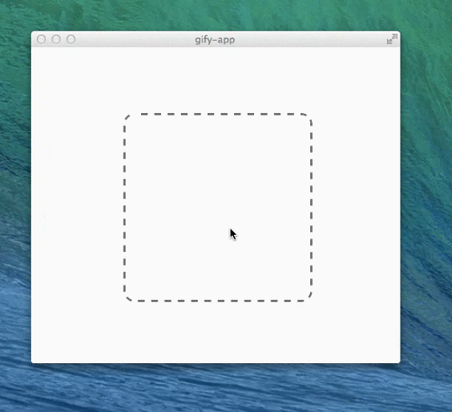

# gify-app 

> Convert videos to gifs as an OS X, Linux and Windows app

The idea came from the post [How to create high quality animated GIFs](https://cloudup.com/blog/how-to-create-high-quality-animated-gifs-from-video) by [@guille](https://github.com/guille), and then I found [@kevva](https://github.com/kevva) made the [imagemin-app](https://github.com/kevva/imagemin-app). So I combined them.

## Install

Get the first binary for [gify-app-mac-v0.1.0.zip](https://github.com/fraserxu/gify-app/releases/download/v0.1.0/gify-app-mac-v0.1.0.zip).


Run it manually by first installing [atom-shell](https://github.com/atom/atom-shell/releases) and follow the instructions below:

```sh
$ git clone https://github.com/fraserxu/gify-app
$ cd gify-app
$ npm install && npm start
$ path/to/atom-shell ./
```

The path to atom-shell differs depending on your OS. Read the [docs](https://github.com/atom/atom-shell/blob/master/docs/tutorial/quick-start.md#run-your-app)
to find out how.

## Related

* [node-gify](https://github.com/visionmedia/node-gify)
* [imagemin-app](https://github.com/kevva/imagemin-app) by @kevva

## Dependencies

* ffmpeg
* graphicsmagick

You can install them through `homebrew` if you are using a mac.

## Todo

* Generate binary file
* Logo

## License

MIT
